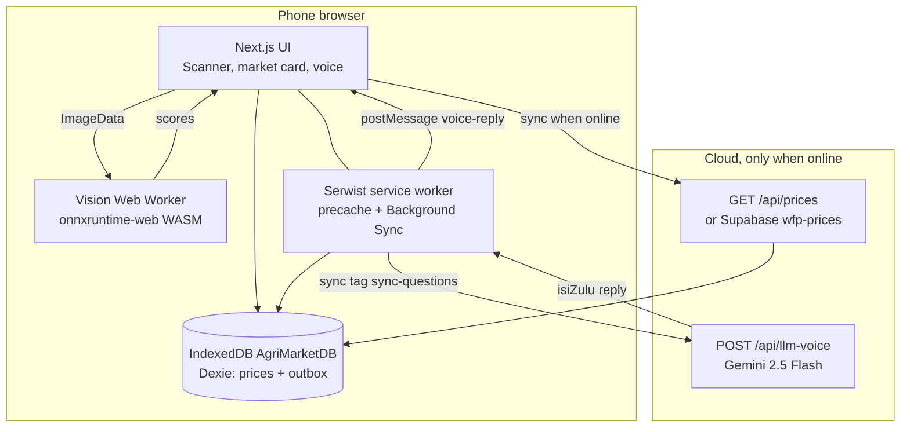

product demo : https://www.youtube.com/shorts/Fxer3EBv6W8
tech demo : https://www.youtube.com/shorts/OBD5Kj20iMg
team demo : https://www.youtube.com/shorts/Es52jyPr0tk 

# Agri-Edge Copilot

Agri-Edge is a phone-first progressive web app for a smallholder coffee farmer who cannot count on a signal, an extension visit, or a fair buyer. The person this build is designed around is Noor, in the Ondera highlands. Yields have slipped. The cooperative is far. The only computer in the household is her daughter’s smartphone, and the language she asks questions in is isiZulu.

The app has three jobs, and each one is built so the important step still works when the radio is down:

1. **See the leaf.** The camera frame is turned into a tensor and scored by a small ONNX model running in WebAssembly, on a background thread, with no server in the loop.
2. **Name a floor price.** A cached World Food Programme-style arabica quote is kept in IndexedDB. If the scan is treated as disease, the screen tells her not to accept less than 90 percent of that quote.
3. **Answer in her language, later if it must.** She speaks. The phone turns speech into text. If there is no signal, the transcript waits in a local outbox. The moment the phone is online again, the queue is sent to a small cloud model, and the isiZulu answer is spoken back.

Agri-Edge advises. It does not spray, sell, or decide for her. A banner on every screen says to consult the cooperative for a severe infestation. Questions about a copper dose are refused in isiZulu and in English.

This repository is the Next.js app. Production builds are meant to be installed on the phone from the browser (Add to Home Screen) and to keep working in airplane mode after the first successful load.

---

## Who it is for, and what the phone can actually do

| Constraint | What the build assumes | What the software does about it |
| --- | --- | --- |
| Device she already has | An ordinary Android phone, portrait, one rear camera, a browser that can install a PWA | Standalone web app manifest, safe-area header, a single `max-w-md` column, large tap targets |
| Intermittent 3G | The radio drops in the field and returns on the walk home | Service worker precache, IndexedDB for prices and voice, Background Sync, hardware `online` / `offline` events |
| Small model files | A multi-gigabyte checkpoint will not fit and will not run | One ONNX file (~14 MB) plus the ONNX Runtime WASM binaries, copied into `public/` and cached |
| Local language | At least one interaction in a language she speaks | Speech recognition and speech synthesis requested as `zu-ZA`; cloud answers written in isiZulu with an English gloss |
| Human in the loop | The tool must not act for her, and must say when it is unsure | Advisory banner, copper-dose hard stop, cooperative referral, no automatic spray or sale |
| No new native app | She will not install from a store or sideload an APK | Installable PWA. No React Native, no custom camera SDK, no third-party audio package |

The interface is high contrast on purpose: emerald and stone for the shell, amber and red for the market warning, so the price floor can be read in sun.

---

## Architecture

Two runtimes cooperate. The **phone** owns vision, the cached price, the voice outbox, and speech. The **cloud** owns only the things that are useless or too heavy to ship inside the browser: a language-model reply, and (when configured) a live market pull. If the cloud is unreachable, the phone keeps the last good price and the unsent questions.



### What never leaves the phone

- The camera frame and the tensor built from it.
- The ONNX session and the WASM runtime, after the first install.
- The IndexedDB price row and the voice outbox.
- The decision to speak an answer (speech synthesis runs in the page, never inside the service worker).

### What is allowed to use the network

- The first visit, which downloads the app shell, the model, and the WASM binaries.
- A price sync, which writes into IndexedDB and then is not required again.
- A voice question that is already transcribed, sent only after `navigator.onLine` is true or a Background Sync fires.

Vision does not call a vision API. There is no image upload.

---

## Repository map

```
agri-edge/
├── src/app/page.tsx                 Home screen: network pill, scanner, market card, voice
├── src/app/layout.tsx               Advisory banner, PWA metadata, theme color
├── src/app/manifest.ts              Installable manifest (portrait, standalone)
├── src/app/offline/page.tsx         Document fallback when a navigation cannot be served
├── src/app/api/llm-voice/route.ts   Cloud voice answer (Gemini, with a dose hard stop)
├── src/app/api/prices/route.ts      Same-origin WFP-shaped price quote
├── src/app/api/ask/route.ts         Earlier fixed isiZulu answers, still in the tree
├── src/components/Scanner.tsx       Camera, capture, worker client, diagnosis card
├── src/components/MarketContextCard.tsx
├── src/components/VoiceAssistant.tsx
├── src/components/SyncManager.tsx   Hidden component that syncs prices on mount and on online
├── src/workers/vision.worker.ts     ONNX session, off the UI thread
├── src/lib/leafTensor.ts            RGBA to NCHW float tensor
├── src/lib/db.ts                    Dexie schema
├── src/lib/sync.ts                  Price sync into Dexie
├── src/lib/voiceQueue.ts            Outbox claim, POST, and delivery
├── src/lib/supabase.ts              Optional Supabase client
├── src/sw.ts                        Serwist routes, model cache, Background Sync
├── public/models/coffee_rust_quantized.onnx
├── scripts/copy-ort-wasm.mjs        Copies WASM binaries into public/ on dev and build
├── next.config.mjs                  Serwist + browser-only ONNX alias
└── vercel.json                      Production build uses npm run build (webpack)
```

`public/sw.js`, `public/ort-wasm.wasm`, and `public/ort-wasm-simd.wasm` are generated. They are gitignored. The ONNX file is committed so a clone can scan offline after one build.

---

## The vision engine

### Pipeline

1. `Scanner` opens the rear camera with `getUserMedia({ video: { facingMode: { ideal: "environment" } } })`. The video element is `playsInline` and muted so mobile browsers will actually show the stream.
2. On **Snap & Analyze**, the current frame is drawn to a canvas and kept as a JPEG data URL. That still image is what the farmer sees under the diagnosis. It is her photo, not a stock leaf.
3. The same frame’s `ImageData` is posted to a dedicated worker:

   ```ts
   new Worker(new URL("../workers/vision.worker.ts", import.meta.url))
   ```

4. The worker resizes with `OffscreenCanvas` and `createImageBitmap` to 224×224, then `rgbaToNchw` packs RGB into a `Float32Array` of length 150528, shape `[1, 3, 224, 224]`, values divided by 255. That is NCHW, the layout ONNX Runtime expects for this family of vision models.
5. `ort.InferenceSession` runs the tensor on the WASM execution provider. The output scores and the elapsed milliseconds are posted back.
6. The button label changes to **Initializing Neural Engine** while the session is created, then **Analyzing Tensors** while `session.run` is in flight. The Ask-by-voice button stays enabled so the page can still be tapped. The heavy math is not on the UI thread.

### Why a worker, and why one WASM thread

ONNX Runtime’s default WASM build can spawn its own pool of threads. Those threads need `SharedArrayBuffer`, which a normal browser tab does not have unless the document is cross-origin isolated (`COOP` / `COEP`). Isolation breaks other things a farmer’s phone needs (some camera and speech behavior, and easy installation). The worker therefore sets:

```ts
ort.env.wasm.wasmPaths = "/";
ort.env.wasm.numThreads = 1;
```

`wasmPaths = "/"` forces the runtime to load `ort-wasm-simd.wasm` or `ort-wasm.wasm` from this origin’s `public/` folder, not from a CDN. `numThreads = 1` keeps inference inside the vision worker and avoids a second nested worker that would fail closed. The UI thread stays responsive: scrolling and the voice button still accept input while a scan is in progress.

`scripts/copy-ort-wasm.mjs` copies both binaries out of `onnxruntime-web` on every `dev` and `build`. SIMD is preferred when the phone has it. The non-SIMD file is the fallback for older CPUs. Both are precached.

The client webpack config aliases `onnxruntime-web` to the `onnxruntime-web/wasm` export. The package’s Node export uses `fs`, which does not exist in the browser and must never be bundled into the phone.

### The model file

| | |
| --- | --- |
| Path the worker loads | `/models/coffee_rust_quantized.onnx` |
| File on disk | `public/models/coffee_rust_quantized.onnx` |
| Bytes | about 14 MB (13.6 MiB) |
| What is in the file today | MobileNetV2-7, ONNX opset 7, from the ONNX Model Zoo mirror on Hugging Face (`onnxmodelzoo/mobilenetv2-7`). The original Model Zoo Git LFS URL returns 404. |
| Input the worker feeds | float32 NCHW `[1, 3, 224, 224]`, RGB scaled by 1/255. The session’s real input name is read from `session.inputNames[0]` (MobileNetV2-7 uses `data`). |
| Output today | A 1000-way ImageNet score vector |

MobileNetV2-7 is the **stand-in** that proves the edge runtime: WASM, offline, worker, cache, and a numeric confidence. It is an ImageNet classifier. It was not trained on coffee leaves. The scanner still has a stable contract for the model that should replace it:

| Output length | How the phone reads it |
| --- | --- |
| 1 | A single logit or probability. At or above 0.5 the label is **Coffee Rust Detected** and the market card opens. |
| 2 | Softmax. Index 0 is healthy, index 1 is rust. Rust at or above 0.5 opens the market card. The label is **Coffee Rust Detected** or **No coffee rust detected**. |
| Any other length, including the 1000-class stand-in | The top score is shown as **Coffee Rust** with that confidence, and the market card opens. This keeps the field demo readable while the real head is not yet in the file. |

To ship a real coffee-rust network, replace the file at the same path. Do not change the worker if the new network is NCHW 224 and returns 1 or 2 scores. A quantized (INT8 or QDQ) coffee model is the intended production artifact; the filename already reserves that slot. A smaller INT8 file also lowers the precache and the first-load time on 3G.

ImageNet preprocessing for a faithful MobileNetV2-7 reading uses mean and standard deviation, not only division by 255. The worker uses the `/255` packing so a future rust head can stay simple. Swapping in an ImageNet-faithful preprocessor is a change to `rgbaToNchw`, not to the service worker or the UI thread.

### Timing observed on a development machine

These are measurements from a desktop browser, not a promise about a five-year-old phone:

- First run after a refresh, model and WASM already in the HTTP cache: on the order of 1–2 seconds. That number includes creating the session, compiling WASM, and one forward pass.
- A later run in the same page, session already warm: about 190–200 ms.

The session promise is reused. A failed create clears the promise so the next tap can try again. `elapsedMs` on the card is the worker’s own clock from the start of the message to the end of `session.run`.

### Offline vision

After one online load, Serwist precaches:

- `/models/coffee_rust_quantized.onnx`
- `/ort-wasm.wasm`
- `/ort-wasm-simd.wasm`
- the app shell `/` and `/offline`

The precache limit is raised to 20 MB because the default Workbox-style cap is 2 MB and would silently drop the model. Runtime caching also registers a **CacheFirst** route for any URL ending in `.onnx` or `.wasm` (cache name `agri-edge-models`, at most 5 entries, 30 days). That route is inserted at the front of the GET router. Serwist’s default cache includes a same-origin catch-all, and the first match wins; if the model route sat behind that catch-all it would never run.

A separate fetch handler answers **worker** `importScripts` of `/_next/static/chunks/*.js` with a plain network fetch. Those requests hang if a caching strategy reuses the original `importScripts` request. Page scripts still go through Serwist.

---

## The market shield

Disease without a price is how a farmer gets cheated on the same day she discovers rust. The market card is the economic half of the scan.

### Local database

Dexie database name: `AgriMarketDB`.

Dexie multiplies the schema version by 10 inside IndexedDB, so schema version 3 appears as IndexedDB version 30. That is expected.

`prices` schema: `id, crop, pricePerKg, lastUpdated`

| Field | Coffee row |
| --- | --- |
| `id` | `coffee-arabica` |
| `crop` | `Coffee (Arabica)` |
| `pricePerKg` | number, US dollars per kilogram |
| `lastUpdated` | ISO timestamp of the last successful sync, or the seed sentence `Cached from WFP 2 days ago` if sync has never landed |

On first launch, if the table is empty, the app seeds **$4.50**. That seed is a floor until a sync replaces it. It is not deleted when the network fails.

### Sync

`SyncManager` is mounted on the home screen and renders nothing. On mount, if `navigator.onLine` is true, and again on every `online` event, it calls `syncMarketPrices()`.

Sync order:

1. If `NEXT_PUBLIC_SUPABASE_URL` and `NEXT_PUBLIC_SUPABASE_ANON_KEY` are set, call the Supabase Edge Function `wfp-prices`.
2. If that returns no quotes, read the Supabase table `market_prices` (`id, crop, pricePerKg`).
3. Otherwise `GET /api/prices` on this origin.

`/api/prices` returns a WFP-shaped quote so the phone has a working sync before a Supabase project is attached:

```json
{
  "source": "WFP",
  "prices": [
    {
      "id": "coffee-arabica",
      "commodity": "Coffee (Arabica)",
      "market": "Ondera",
      "currency": "USD",
      "unit": "kg",
      "price": 4.62,
      "date": "YYYY-MM-DD"
    }
  ]
}
```

A successful sync `bulkPut`s the rows and stamps `lastUpdated` with the current ISO time. A failed sync logs a warning and leaves the previous row in place. The card never reads the network itself. It reads Dexie through `useLiveQuery`, so a sync updates the screen without a reload, and a reload with the radio off still shows the saved quote.

### What the farmer sees

The card renders only when the scanner sets disease. The warning is fixed at a 10 percent value loss:

> Disease Impact: 10% Value Loss. Do not accept less than $X.XX/kg from buyers today.

`$X.XX` is `pricePerKg * 0.9`. After a sync to $4.62 that floor is **$4.16**. On the seed price of $4.50 it is **$4.05**. Under the warning, the card prints **Last synced:** as a relative time (`just now`, minutes, hours, or days). A non-date seed string is shown as stored.

The 10 percent figure is a transparent rule in the client, not a model output. It is there so a buyer cannot talk her below a published benchmark on the day rust is on the leaf. It is not a forecast of her personal yield.

---

## Voice: store-and-forward

Speech uses the browser. There is no Whisper package, no audio encoder shipped to the phone, and no recording uploaded as a file. `SpeechRecognition` (or `webkitSpeechRecognition`) produces a transcript. `speechSynthesis` speaks the answer with `lang = "zu-ZA"`. If the phone rejects `zu-ZA` for recognition, the recognizer retries once with `navigator.language`.

Chrome’s recognition engine often needs a network to turn audio into text. The queue protects the **transcript**. If she gets words out and the POST then fails, or if `navigator.onLine` is already false, the words are stored. If the phone cannot transcribe at all without a signal, the screen says so instead of pretending a question was captured.

### Outbox

Schema version 3:

```
outbox: ++id, text_transcript, timestamp, status
```

| Field | Role |
| --- | --- |
| `text_transcript` | The words she said |
| `timestamp` | `Date.now()` when the question was captured |
| `status` | `queued`, `sending`, or `ready` |
| `reply` | isiZulu answer, filled when the cloud responds |
| `meaning` | English gloss for the screen |
| `text` | Legacy field from an earlier schema, copied into `text_transcript` on upgrade |

Status flow:

1. **queued** — waiting for a signal. The screen shows **Queued ⏳** and the transcript.
2. **sending** — a worker holds the row and is POSTing. A crashed send is reclaimed to `queued` on the next flush so a reload cannot strand the question.
3. **ready** — the answer is stored because no window was open to hear it. The next time the app opens, the page speaks it and deletes the row.

Flushes take a `navigator.locks` lock named `agri-edge-voice` so the page and the service worker do not POST the same row twice.

### When the signal returns

Two paths, same POST:

- The page, on mount and on the `online` event, registers Background Sync tag `sync-questions` and also flushes if it is in the foreground.
- The service worker, on `sync` with that tag, reads the outbox, POSTs each transcript to `/api/llm-voice`, and `postMessage`s `{ type: "voice-reply", reply, meaning, question, id }` to open windows.

If a window is open, the row is deleted after the message is sent and the page speaks. If every tab is closed, the row stays `ready` with the reply text. Opening the app speaks that reply. Speech cannot run inside the service worker; the worker’s job is to finish the network call and hand the sentence back.

`reloadOnOnline` is enabled in Serwist, so a controlled page may reload when the radio returns. The outbox is in IndexedDB, so the reload does not lose the question. The new page flushes it.

### The cloud model

`POST /api/llm-voice` accepts `{ text, timestamp }` and returns:

```json
{ "reply": "…isiZulu…", "meaning": "…English…" }
```

The route uses `@google/genai` and `gemini-2.5-flash` with temperature 0.2 and `responseMimeType: "application/json"`. The system instruction tells the model:

- It is an advisor for a coffee farmer in Ondera.
- `reply` is one or two spoken isiZulu sentences.
- `meaning` is the English of that reply.
- It must not give a pesticide dose, copper amount, or mixing rate.
- If it is unsure, it must say so and send her to a person at the cooperative.
- It must not claim it inspected the field.

Before the model is called, any question matching `copper` or `ithusi` returns a fixed sentence and never reaches Gemini:

> Ngiyakuzwa. Le app ayikwazi ukukutshela ukuthi usebenzise i-copper spray engakanani. Cela i-cooperative yakho e-Ondera ikusize ngaphambi kokufafaza.

English: “I heard you. This app cannot choose a copper spray dose. Ask your Ondera cooperative before you spray.”

If a model reply still looks like a dose (a number plus a unit such as ml, litre, gram, or the words dose, spray, copper, ithusi), it is replaced with that same refusal. If `GEMINI_API_KEY` is missing or the provider errors, the route returns a general isiZulu advisory that the app only advises and she should ask the cooperative. The queue still clears. She is not left on **Queued** because the cloud had a bad day.

`src/app/api/ask/route.ts` is the earlier fixed-reply route. The voice UI now calls `/api/llm-voice`.

---

## API reference

All routes are same-origin. The phone does not embed a third-party URL in the client for vision or for the voice POST.

### `POST /api/llm-voice`

| | |
| --- | --- |
| Body | `{ "text": string, "timestamp": number }` |
| 400 | `{ "error": "Ask a question first." }` when `text` is empty |
| 200 | `{ "reply": string, "meaning": string }` |
| Auth | None on the route. The Gemini key stays on the server in `GEMINI_API_KEY`. |

### `GET /api/prices`

| | |
| --- | --- |
| Body | none |
| 200 | `{ "source": "WFP", "prices": [ { id, commodity, market, currency, unit, price, date } ] }` |
| Role | Stand-in quote until Supabase `wfp-prices` or `market_prices` is configured. The client writes the result into Dexie and then reads only Dexie. |

### `POST /api/ask`

Fixed isiZulu answers used by the first voice increment. Copper and ithusi map to the dose refusal. Everything else maps to the general advisory. The live microphone button does not call this route anymore.

### Optional Supabase

`src/lib/supabase.ts` builds a browser client only when both public env vars are present. The anon key is a publishable client key. Do not put the service role key in `NEXT_PUBLIC_*` or in this repository.

Expected cloud objects, when you attach a project:

- Edge Function `wfp-prices`, returning `{ prices: [...] }` or a bare array of `{ id, crop or commodity, pricePerKg or price }`.
- Table `public.market_prices` with `id`, `crop`, `pricePerKg`, RLS enabled, and a select policy that matches how the anon key is meant to read it.

If either call fails, sync falls through to `/api/prices`. The phone does not crash.

---

## Service worker and install

`@serwist/next` compiles `src/sw.ts` to `public/sw.js` during `next build --webpack`. `next dev` uses Turbopack, which cannot run that webpack plugin, so the plugin is disabled when `NODE_ENV === "development"`. Offline precache, Background Sync, and the model cache are properties of the production build (`npm run build` then `npm start`, or a Vercel deploy). `vercel.json` sets `buildCommand` to `npm run build` so Vercel does not fall back to Turbopack.

Manifest (`src/app/manifest.ts`):

- Name: Agri-Edge Copilot. Short name: Agri-Edge.
- `display: standalone`, `orientation: portrait`.
- Theme `#14532d`, background `#f0fdf4`.
- Icons at 192 and 512, plus a maskable 512.

The layout sets `appleWebApp` so an iPhone home-screen icon uses the same short name. The theme color matches the header.

Document navigations that miss the cache fall back to `/offline`, which explains that the shell, scans, and cached prices still exist on the phone.

---

## Responsible AI

This is an advisory tool. The pass that matters:

| Rule | Where it is enforced |
| --- | --- |
| Do not act for the user | No spray actuator, no payment, no message sent to a buyer. The market card is a sentence she can say out loud. |
| Do not invent a chemical dose | Server-side regex before Gemini, a second check on the model text, and a fixed isiZulu refusal. The model is not asked to “be careful” and then trusted. |
| Say when a person is required | System instruction and the fallback reply both send her to the Ondera cooperative. The banner says the same in English on every screen. |
| Do not pretend the stand-in ImageNet file is a field-validated rust detector | The worker contract above is the honest one. A 1- or 2-class coffee model is a file swap. Until that file is trained and evaluated on real leaves, treat on-screen rust from the 1000-way network as a demonstration of the runtime, not a diagnosis you would bet a harvest on. |
| Keep her image on the device | The tensor is built in a worker from `ImageData`. Nothing in the vision path calls `fetch` with pixels. |
| Keep the cloud key on the server | `GEMINI_API_KEY` is read only in the route handler. It is not a `NEXT_PUBLIC_` variable. |

The price floor is a published benchmark minus a stated 10 percent. It is not a personal credit score and it does not hide the source line. The card shows the crop, the reference price, and when it was last synced.

---

## Small AI, and how it scales without getting large

“Small” here means the model that has to run in the field is small enough for the phone she already has, and the model that needs a data center is called only for language, only after a transcript exists, and only when a radio is up.

### On device, by design

- One vision network, 224 input, WASM, one thread.
- Weights are a static file under `public/models`. Replacing it does not require a new app binary or a store review.
- The runtime is cached by the service worker. The second open does not re-download 14 MB of weights or 10 MB of WASM.
- The UI never blocks on `session.run`. A low-end phone drops frames when tensor math shares the main thread; the worker exists so it does not.
- Market math is one multiplication. It does not need a model.
- Speech capture and playback are operating-system features. The JavaScript added for voice is the outbox, not a neural net.

### In the cloud, by design

- Gemini 2.5 Flash is a small, fast language model for a two-sentence answer, not a long agronomy report. Temperature is low so the same question does not wander.
- The route is a single POST. A different provider can replace the body of `src/app/api/llm-voice/route.ts` without a change to Dexie, the service worker tag, or the microphone button. The client only knows `{ reply, meaning }`.
- Price sync is the same idea. Supabase, a WFP pull inside an Edge Function, or the local `/api/prices` stand-in all normalize to one Dexie row. The card does not care which one succeeded.
- The outbox is the scale path for bad networks. A thousand farmers on one tower do not each need a streaming socket. They need a short POST when the tower is reachable, and silence when it is not. Background Sync is that POST. Failed sends go back to `queued` and the browser retries the sync tag.

### What you would add for a real deployment, without redesigning

- Train or distill a coffee-rust classifier (healthy vs rust, or healthy vs rust vs other) and export ONNX at 224 NCHW, preferably INT8. Drop it on the same URL. The 1- and 2-score branches already open or hide the market card from the probability.
- Point `wfp-prices` at a real WFP or national market series for arabica, still writing `pricePerKg` in the currency you intend to show. Keep the “last synced” stamp so a stale quote is visible.
- Put `GEMINI_API_KEY` in the host’s environment. Optionally add a per-device rate limit on `/api/llm-voice` so a stolen phone cannot run up a bill. The key never ships in the client bundle.
- Evaluate the rust model on leaves from the same region before calling the market card a diagnosis. Until that evaluation exists, the stand-in file should not be described as clinically validated.

None of those steps require a bigger phone app. The phone app’s size stays dominated by one ONNX file and the WASM runtime.

---

## Constrained environment

### Memory and CPU

The vision worker holds one session and one 224×224 tensor (150528 floats, under a megabyte) plus the decoded weights. `numThreads = 1` caps the CPU fan-out. The session is cached in the worker for the lifetime of the page so a second snap does not recompile WASM.

### Storage

IndexedDB holds a handful of price rows and voice transcripts, not images. The captured JPEG lives in React state for the diagnosis card and is not written to disk. The large persistent bytes are the precached model and WASM, which the service worker already has to store for offline scans.

### Network

First load is the expensive one: HTML, JS, CSS, a ~14 MB model, and ~10 MB of SIMD WASM (the non-SIMD binary is also precached for older CPUs). After that, airplane mode is a supported state, not an error. The network pill reads `navigator.onLine` and the `online` / `offline` events. There is no demo toggle.

### Input

- Camera permission is required for a scan. Denial shows a short instruction, not a blank screen.
- Microphone permission is required for voice. Denial is explained. A recognition `network` error tells her the phone could not transcribe without a signal.
- The layout is portrait, one column, buttons at least 56px tall.

### Browsers

The production path is Chromium (Chrome or Samsung Internet) on Android: service workers, Background Sync, WebAssembly SIMD, `OffscreenCanvas`, and the speech APIs. Safari has speech synthesis and a subset of PWA behavior; Background Sync and `SpeechRecognition` are weaker there. The outbox still stores the transcript, and the page flushes it on the next `online` event even if `registration.sync` is missing.

---

## Environment variables

Create `.env.local` in `agri-edge/`. It is gitignored. Do not commit it.

| Variable | Required | Where it is read |
| --- | --- | --- |
| `GEMINI_API_KEY` | For live language answers | `src/app/api/llm-voice/route.ts` only |
| `NEXT_PUBLIC_SUPABASE_URL` | Only if you attach Supabase | `src/lib/supabase.ts` |
| `NEXT_PUBLIC_SUPABASE_ANON_KEY` | Only if you attach Supabase | `src/lib/supabase.ts` |

Without the Gemini key, voice still answers with the cooperative advisory. Without Supabase, prices still sync from `/api/prices`.

On Vercel, set `GEMINI_API_KEY` in the project environment. The production build command is already `npm run build`.

---

## Run it

Requirements: Node.js 20 or newer, npm.

```bash
cd agri-edge
npm install
# optional, for live isiZulu answers:
# echo 'GEMINI_API_KEY=your-key' > .env.local
npm run build
npm start
```

Open `http://localhost:3000`. For a production-like check of the service worker, use `npm start` after `npm run build`. `npm run dev` is the right loop for UI edits; it does not emit the service worker.

Install on a phone: serve the production build over HTTPS (Vercel does this), open it in Chrome, and use Add to Home Screen. Load once on Wi-Fi so the model and WASM land in Cache Storage. Then airplane mode is a fair test.

### Judge’s pass

1. **Install and shell.** Home screen icon, portrait layout, advisory banner, Online / Offline pill that follows the real radio.
2. **Scan.** Allow the camera. Tap Snap & Analyze. The still photo appears, then a diagnosis and a confidence. The rest of the page stays tappable while the worker runs. In Application → Cache Storage, confirm the `.onnx` file and the `ort-wasm*.wasm` files after the first load.
3. **Airplane scan.** Turn the radio off, reload, scan again. The worker should run from cache. No image is uploaded.
4. **Market card.** When the scan flags disease, the card shows the 10 percent floor, the reference price, and **Last synced**. Reload offline. The same price is still there. IndexedDB database `AgriMarketDB`, object store `prices`, key `coffee-arabica`.
5. **Voice queue.** With the radio off, ask a question if the phone can transcribe; otherwise confirm a queued row. The UI shows **Queued ⏳**. In IndexedDB, object store `outbox`, fields `text_transcript`, `timestamp`, `status`. Turn the radio on. The row clears and an isiZulu sentence is shown and spoken (`zu-ZA`). Ask how much copper spray to use. The answer must refuse a dose and name the Ondera cooperative.
6. **Closed tab.** Queue a question, close the tab, restore the network, open the app again. A `ready` row is spoken on open if the sync finished while the tab was gone.

---

## Stack

| Piece | Choice | Why |
| --- | --- | --- |
| App | Next.js 16.3 App Router, React 19 | Server routes for the two cloud calls, static shell for the phone |
| Styling | Tailwind CSS 4 | Utility classes, no component library to download |
| PWA | `@serwist/next` 9, webpack production build | Precache including a 14 MB model, runtime CacheFirst for `.onnx` / `.wasm` |
| Vision | `onnxruntime-web` 1.17.1, WASM, one worker | Runs where there is no GPU API and no signal |
| Local data | Dexie 4 and `dexie-react-hooks` | IndexedDB with a live UI binding, no cloud database on the critical path |
| Language | Web Speech API + Gemini 2.5 Flash through `@google/genai` | Small on-device surface, small cloud answer, isiZulu |
| Optional market backend | `@supabase/supabase-js` | Swap-in for a real WFP pull without rewriting the card |
| Host | Vercel, `buildCommand`: `npm run build` | HTTPS, which installable PWAs and the microphone require |

---

## License and data

The application code in this repository is the Agri-Edge hackathon build. The vision weights currently shipped are MobileNetV2-7 from the ONNX Model Zoo, used as an offline runtime stand-in under that model’s original license. Replace them with a coffee-rust ONNX file before any claim of field diagnosis. Market figures shown by `/api/prices` are a structured stand-in for a WFP quote, not a live feed, until Supabase or another pull is connected. Do not commit API keys.
